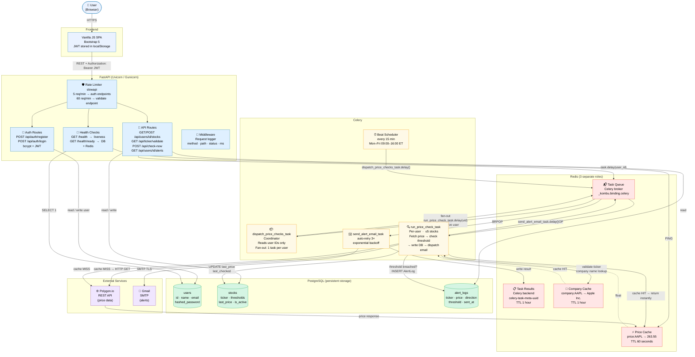

# Stock Monitor — Architecture Diagram

Paste the diagram below into https://mermaid.live to render it interactively.



---

## ASCII Quick Reference

```
┌─────────────────────────────────────────────────────────────────────────┐
│                           BROWSER (SPA)                                 │
│              Vanilla JS · Bootstrap 5 · JWT in localStorage             │
└───────────────────────────────┬─────────────────────────────────────────┘
                                │  HTTPS · Authorization: Bearer <JWT>
                                ▼
┌─────────────────────────────────────────────────────────────────────────┐
│                    FASTAPI  (Uvicorn / Gunicorn)                        │
│                                                                         │
│  ┌──────────────┐  ┌────────────────────┐  ┌────────────────────────┐  │
│  │ Rate Limiter │  │   Auth Routes      │  │   API Routes           │  │
│  │  (slowapi)   │  │ /api/auth/register │  │ /api/users/*/stocks    │  │
│  │  5/min auth  │  │ /api/auth/login    │  │ /api/ticker/validate   │  │
│  │ 60/min valid │  │ bcrypt + JWT       │  │ /api/check-now         │  │
│  └──────────────┘  └────────────────────┘  └────────────────────────┘  │
│                                                                         │
│  ┌─────────────────────────────┐  ┌─────────────────────────────────┐  │
│  │ Health Checks               │  │ Request Logger (middleware)      │  │
│  │ /health      → liveness     │  │ method · path · status · ms     │  │
│  │ /health/ready→ DB + Redis   │  └─────────────────────────────────┘  │
│  └─────────────────────────────┘                                        │
└──────────┬───────────────────────────────────┬──────────────────────────┘
           │ read/write                        │ task.delay(user_id)
           ▼                                   ▼
┌──────────────────────┐            ┌──────────────────────────────────────┐
│  POSTGRESQL          │            │  REDIS                               │
│                      │            │                                      │
│  ┌────────────────┐  │            │  ┌─────────────────┐                 │
│  │ users          │  │            │  │  Task Queue     │ ← Celery broker │
│  │ id,name,email  │  │            │  │  (LPUSH/BRPOP)  │                 │
│  │ hashed_pass    │  │            │  └────────┬────────┘                 │
│  ├────────────────┤  │            │           │                          │
│  │ stocks         │  │            │  ┌────────▼────────┐                 │
│  │ ticker         │  │            │  │  Task Results   │ ← Celery backend│
│  │ thresholds     │◄─┼────────────┼──│  TTL 1 hour     │                 │
│  │ last_price     │  │            │  └─────────────────┘                 │
│  ├────────────────┤  │            │                                      │
│  │ alert_logs     │  │            │  ┌─────────────────┐                 │
│  │ price,direction│  │            │  │  Price Cache    │ TTL 60 seconds  │
│  │ threshold      │  │            │  │  price:AAPL     │                 │
│  └────────────────┘  │            │  ├─────────────────┤                 │
└──────────────────────┘            │  │  Company Cache  │ TTL 1 hour      │
                                    │  │  company:AAPL   │                 │
                                    │  └─────────────────┘                 │
                                    └──────────┬───────────────────────────┘
                                               │ BRPOP (workers pull tasks)
┌──────────────────────────────────────────────▼───────────────────────────┐
│  CELERY                                                                  │
│                                                                          │
│  ┌───────────────────┐    fires every 15min    ┌──────────────────────┐  │
│  │  Beat Scheduler   │ ──── Mon–Fri 9–4 ET ──► │  dispatch task       │  │
│  │                   │                         │  reads user IDs only │  │
│  └───────────────────┘                         │  fan-out 1 task/user │  │
│                                                └──────────┬───────────┘  │
│                      ┌─────────────────────────────────────┘             │
│                      ▼  (one task per active user)                       │
│          ┌─────────────────────────┐                                     │
│          │  run_price_check_task   │                                     │
│          │  ≤ 5 stocks per user    │                                     │
│          │  1. get price           │──── cache miss ──►  Polygon.io API  │
│          │     (Redis cache first) │◄─── price data ──── (HTTP GET)      │
│          │  2. check thresholds    │                                     │
│          │  3. update DB           │──────────────────►  PostgreSQL      │
│          │  4. breach? → email     │                                     │
│          └───────────┬─────────────┘                                     │
│                      │ send_alert_email_task.delay()                     │
│                      ▼                                                   │
│          ┌─────────────────────────┐                                     │
│          │  send_alert_email_task  │──────────────────►  Gmail SMTP      │
│          │  auto-retry 3×          │                     (TLS port 587)  │
│          │  exponential backoff    │                                     │
│          └─────────────────────────┘                                     │
└──────────────────────────────────────────────────────────────────────────┘
```
